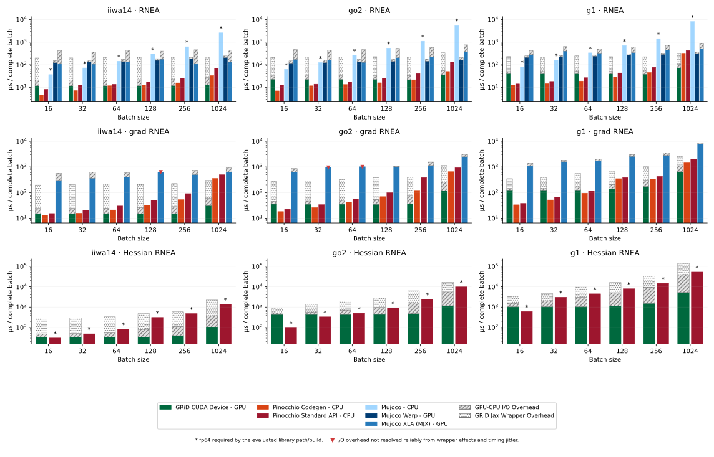
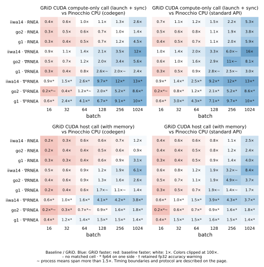
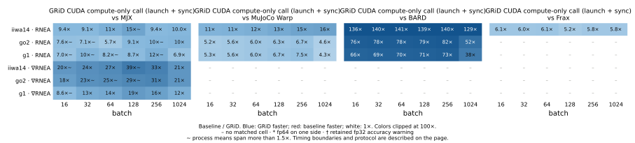
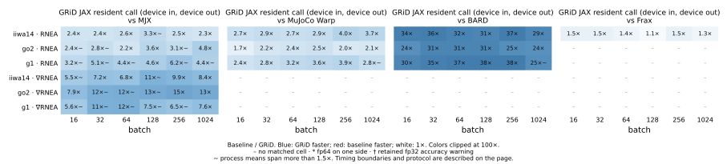
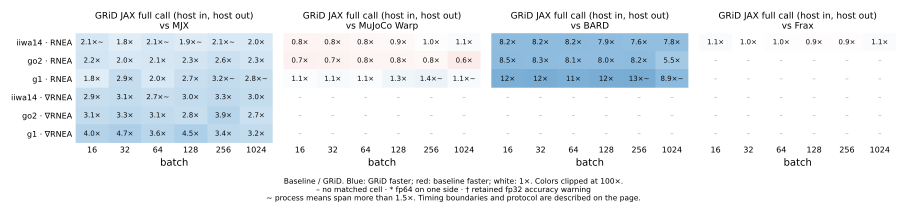

Release measurements
====================

.. note::

   **Data from the 27 September 2026 run:** 210 worker processes,
   1,260 measurements, all passing the existing strict numerical checks.
   **Wrapper addendum, 2 October 2026:** 108 further worker processes and
   648 measurements under the same protocol, for the allocate-once calls
   in Figure 4. The published table now holds 300 workers and 1,800
   measurements; every GRiM-versus-baseline comparison is unchanged.

These measurements cover **iiwa14** (fixed base, 7 velocities), **go2** (floating
base, 18 velocities), and **G1** (floating base, 35 velocities) on one NVIDIA
RTX 5090 and Intel Core Ultra 9 285K system. Batch sizes are 16, 32, 64, 128,
256, and 1024. The main figures compare RNEA, its analytical gradient, and its
analytical Hessian. The wrapper study covers the same three operations
through CUDA C++, the C ABI (RNEA and its gradient), NumPy, JAX, and PyTorch,
with each Python surface measured as its default call and with its buffers
allocated once and reused.

The main collection used commit ``e92477857b0ca53fb307a8fa4799a4afd5757177``.
It includes the floating-base JAX Hessian packing correction and preserves
fp64 mapped inputs for Pinocchio's analytical paths. No numerical tolerance
was relaxed. Subsequent figure and documentation edits do not alter timed code.

The wrapper addendum used commits ``53119f2d4c0b1297af19b9bd266879828001c566``
and ``ab20188681334da365753b42da5f0021c4c70add`` (the latter for the JAX
allocate-once cells). Between the two collections the bindings changed in the
ways Figure 4 describes; the generated CUDA did not. A same-day drift check
re-measured GRiM's native CUDA call on all 18 RNEA-gradient cells: both its
compute-only and its host call landed within 0.6% of the September values.

What the measurements show
--------------------------

GRiM's strongest performance is available to solvers and libraries that keep
robot data on the GPU. The measurements also show that this advantage can
survive transfers and framework dispatch, rather than being limited to the
compute-only boundary.

* **Fast robot-specific CUDA for GPU-resident applications.** GRiM's native
  compute-only call has a lower median than every evaluated GPU baseline on
  its matched core RNEA/gradient cells. Against MuJoCo Warp and MJX, the
  ratios span 4.3–38.6×. These are resident-call comparisons, not isolated
  kernel comparisons: GRiM includes native launch and synchronization;
  the competitors also include their framework dispatch.
* **GRiM's JAX API is faster than MJX on all 36 matched RNEA/gradient cells.**
  The ratios are 1.8–4.7× for complete host-to-host calls and 2.2–14.7× with
  inputs and outputs resident on the GPU. Every one of these comparisons
  remains above 1× across the observed ranges of the three process means.
  These are measured ranges, not statistical confidence intervals.
* **Large-batch gradients show substantial compute and host-call gains.**
  At batch 1024, GRiM's compute-only CUDA calls for RNEA gradients are
  11.7× faster on iiwa14 and 5.6× faster on go2 than Pinocchio codegen's
  CPU calls. GRiM takes 30.8 µs and 116.6 µs, respectively, versus
  361.3 µs and 657.8 µs for Pinocchio codegen. The compute-only comparison
  excludes GRiM's transfers but includes native launch and synchronization.
  Including transfers, GRiM's C++ host calls take 59.4 µs and 257.3 µs,
  retaining 6.1× and 2.6× speedups at the matched host-to-host boundary.
  These host-call wins remain separated across the observed repeat ranges.
* **Larger batches turn compute gains into host-call wins.** Including
  transfers, GRiM's CUDA host call has a lower median than the Pinocchio
  codegen-mode adapter in 14 of 45 core cells at batches 16–256; 13 of those
  wins remain separated across observed ranges. At batch 1024, it wins 8 of
  9 cells across those ranges; the remaining comparison overlaps. Both
  Pinocchio modes use the same standard analytical fp64 path for Hessians,
  not a code-generated Hessian. Pinocchio wins many small-batch comparisons,
  particularly the lighter RNEA workload when GRiM's transfers are included.
  The batch-1024 wins include all three robots' Hessians. There are also
  selective wins with JAX overhead included: iiwa14's RNEA gradient at batch
  1024 takes 303.6 µs through GRiM JAX versus 361.4 µs through Pinocchio
  codegen, a 1.2× median speedup for complete host-to-host calls.
* **Wrapper costs matter.** GRiM JAX resident calls beat MuJoCo Warp on all
  18 matched RNEA cells across observed ranges, but the host-to-host results
  are mixed. On iiwa14 RNEA at batch 256, median full calls are 23.3 µs in
  CUDA, 24.7 µs through the C ABI, 26.8 µs through NumPy, 61.0 µs through
  PyTorch, and 224.8 µs through JAX. This is one illustrative cell, not a
  universal wrapper overhead.
* **Allocating once removes most of the NumPy and PyTorch wrapper cost.**
  A default Python call allocates its output on every call. With the buffers
  created once and reused, NumPy and PyTorch are faster in all 90 measured
  cells, and at batch 1024 they land within 10% of the C++ host call on
  the go2 and G1 gradients and Hessians (from 1% faster to 9% slower). G1's RNEA gradient at batch 1024
  takes 1.13 ms in C++, 1.18 ms through NumPy and 1.14 ms through PyTorch,
  against 2.79 ms and 3.32 ms for their default calls; its Hessian takes
  38.0 ms, 38.0 ms and 39.5 ms against 107.0 ms and 235.5 ms. JAX's
  ``to_host`` helps on large outputs (41.5 ms against 140.9 ms on that
  Hessian) and is the default download below 256 KiB.

Figure 1 — Where the time goes
------------------------------

Keeping data on the GPU makes the most of GRiM's compute performance.
Larger batches can amortize transfers, with host-call wins extending to
analytical Hessians on all three robots at batch 1024. Full JAX calls can
also win, as the iiwa14 gradient example above illustrates; the crossover
depends on the operation, batch size, robot, and baseline.
Pinocchio wins many small-batch host-call comparisons, especially for RNEA;
GPU execution is not the fastest choice for every workload.

Absolute microseconds per complete batch, on a log axis. GRiM's JAX full-call
bar is decomposed into its native CUDA compute-only call, the CUDA transfer
increment, and the additional JAX API increment. Green denotes the CUDA call,
gray diagonal hatching the GPU–CPU I/O increment, and gray dots on white the
JAX wrapper increment.
These are **differences of measured call times**, not isolated
measurements of individual wrapper components. The CUDA compute-only call
includes native host launch and synchronization; it is not CUDA-event timing
of a bare kernel.

GPU competitors show resident calls plus full-call increments when the
decomposition is consistent. Pinocchio's two API modes are separate bars for
RNEA and its gradient. Only its standard analytical fp64 API is shown for the
Hessian; there is no codegen Hessian bar. BARD and Frax remain in the tables
but are omitted from this figure for clarity.
A red triangle means
the decomposition is unavailable and the **measured full-call total** is shown
without a stack. Three MJX gradient cells have this flag because at least one
repeat's resident time exceeded its full-call time, even though the median
difference is positive. Neither boundary is discarded or clamped.

Figure 2 — Speedup against Pinocchio (CPU)
--------------------------------------------

Ratios are baseline time divided by GRiM time. Above 1× favors GRiM; below 1×
favors the baseline. The top row excludes GRiM's host–device transfers and is
therefore a different workload boundary from Pinocchio's host-array call.
The bottom row includes GRiM's transfers and compares host arrays in and out
on both sides. Pinocchio uses a persistent C++ thread pool, choosing the best
recorded candidate from ``{1, max(1, batch//16), 8}``, excluding counts above
eight or the batch size. Eight is this study's configured worker ceiling,
not a Pinocchio limit; counts above eight were not evaluated. All 24 logical
CPUs were available to the processes. All tested variants are retained in
the raw captures.

Pinocchio's CPU paths are strong at small batches, particularly for RNEA.
Transfers can reverse a compute-only advantage: for iiwa14's RNEA gradient
at batch 32, GRiM's compute-only call takes 14.8 µs versus 15.8 µs for
Pinocchio codegen, but GRiM's full C++ host call takes 24.6 µs.

Figure 3 — Speedup against the GPU libraries
--------------------------------------------

**Top:** native CUDA compute-only calls against competitors' resident API
calls. Both include launch and synchronization, but only the competitors pay
framework dispatch. **Middle:** resident API calls with framework dispatch on
both sides. **Bottom:** full host-to-host calls on both sides. These boundaries
answer different application questions and must not be combined into one
unqualified speedup claim.

Heatmaps show ratios of medians, not guarantees of separation across repeat
ranges. ``~`` marks a side whose run means span more than 1.5×. Colors are
clipped at 100×; printed cell values retain the measured ratios. Missing cells
reflect adapter coverage, model mismatch, or study scope, not library-wide
incapability. No finite-difference or nested-autodiff Hessian sweep was added
to this analytical-Hessian comparison.

Figure 4 — Wrapper costs
------------------------

.. image:: _static/release/wrappers.svg
   :alt: RNEA, gradient and Hessian call wall times for CUDA Device, C++ Host, NumPy, PyTorch and JAX; each Python bar is solid up to its allocate-once call with a hatched cap up to its default call.
   :target: _static/release/wrappers.svg

Bars show the measured wall time at each call boundary, ordered CUDA Device,
C++ Host, NumPy, PyTorch, JAX. CUDA Device is the native compute-only call
with resident data, including launch and synchronization; it is not bare
device-event timing. C++ Host includes transfers with prepared host buffers.
The Python bars are complete host-to-host API calls, and each shows two
measurements in one slot:

* the **solid** bar is the *allocate-once* call: the I/O buffers are created
  once, outside the timed window, and every timed call reuses them;
* the **hatched cap** above it reaches the *default* call, which allocates its
  output on every call.

The allocate-once calls are, per surface: NumPy — ``out=`` with a page-locked
buffer from ``handle.pinned_empty`` (the gradient and Hessian; RNEA has no
``out=``, so its bar is the default call); PyTorch — page-locked host tensors
for inputs and outputs with non-blocking copies
(``pinned_host_like`` / ``copy_to_host``); JAX — ``grim.jax.to_host``.
``to_host`` uses its page-locked route only for arrays of at least 256 KiB and
is otherwise the default download itself, so a JAX allocate-once bar is drawn
only where that route was taken (23 of 54 cells). A short black tick marks the
one cell where the default call was not the slower of the two (JAX, iiwa14
gradient at batch 1024, by 6%).

Default and allocate-once are the same compiled artifact and the same
operation; only the buffer handling differs. NumPy and PyTorch are faster
with reused buffers in every measured cell: by 1.1–2.9× for NumPy and
1.2–6.0× for PyTorch, growing with output size. Where the JAX page-locked
route applies, the median gain is 1.3× on gradients and 2.1× on Hessians,
up to 3.4×.

The C ABI remains available in the downloadable data but is omitted from this
application-facing figure. Its RNEA-gradient call, and the NumPy call built on
it, used to download the result twice; they now download it once, which made
the default calls 1.07–1.34× (C ABI) and 1.06–1.27× (NumPy) faster than the
September measurements they replace in the table.

**Which collection each bar comes from.** CUDA Device, C++ Host, the PyTorch
and JAX default calls and NumPy's RNEA are the 27 September measurements. The
allocate-once calls, NumPy's default gradient and the NumPy and PyTorch default
Hessians are from 2 October. JAX full calls vary more between sessions than
the other surfaces (its default gradient re-measured between 0.80× and 1.20×
of the September values on 2 October), so read small JAX differences with
that in mind.

Protocol
--------

* Three independent worker-process repeats per robot, backend and operation.
  Each boundary warms for at least five calls and 1.5 seconds, then records
  **300 samples for the main and wrapper figures**. Reported times are medians
  of the three process means, with every repeat retained.
* CPU governors were ``performance`` on all 24 CPUs, with all CPUs available
  to the processes. Raw EPP was ``default`` under active ``intel_pstate``;
  the complete policy is captured. A diagnostic P-core-only pilot did not
  consistently improve results and is not included in release timing data.
* The box was reserved for serial measurement, with quiet checks between
  workers. Native CUDA, C ABI, NumPy, PyTorch, Warp and the other stable paths
  were not exempted from variability checks. Of 600 supported groups, 22
  full-call groups span more than 1.5× across process means; 23 of 240
  resident groups do so. These are marked, not selectively rerun.
* Resident means inputs already on the GPU and outputs left there, including
  synchronization and any device-side copies. Full call includes host input
  upload and output download. CUDA boundaries use the generated host functions
  through a C++ timing harness.
* fp32 arithmetic except marked ``*`` cells: Pinocchio analytical Hessians
  and MuJoCo CPU in this core study. Secondary tables also include fp64
  Pinocchio end-effector pose. Input precision is recorded separately.
* Identical seeded states, normalized quaternions, URDF hashes and input-value
  hashes are used across backends. Every timed cell is checked before and
  after timing against RBDReference's Pinocchio-backed fp64 oracle, plus
  repeatability and boundary agreement (entrywise ``rtol=2e-4, atol=1e-3``).
  This is a separate reference path, not an independent library when checking
  Pinocchio itself. All 1,800 measurements pass the strict checks.
* Allocate-once calls set up their buffers once per batch size, before the
  warm-up, and never inside the timed window. Their validation outputs are
  copied out of the reused buffers, so the before/after oracle checks compare
  snapshots and not two views of one buffer.

Downloads and reproduction
--------------------------

* `Browse both complete tables <_static/release/tables.html>`_.
* :download:`Core and wrapper CSV <_static/release/table.csv>`:
  792 planned cells, including 600 validated and 192 explicit N/A cells.
* :download:`Secondary-operation CSV <_static/release/secondary_table.csv>`:
  the remaining operations, retained from the earlier **30-sample** collection.
  This is a separate population, not mixed with 300-sample core comparisons.
* :download:`Decomposition CSV <_static/release/decomposition.csv>`;
  :download:`observed comparison ranges <_static/release/comparisons.json>`.
* :download:`Audit summary <_static/release/audit.json>`,
  :download:`figure manifest <_static/release/manifest.json>`, and
  :download:`secondary provenance <_static/release/secondary_provenance.json>`.

Every table row includes status, reason, dtype, times, run ranges and numerical
error information. ``adapter_pending`` means our adapter is not wired;
``excluded_method`` means outside the analytical study; ``model_mismatch``
identifies Frax's unvalidated floating-base conversion; ``not_applicable``
marks NumPy's allocate-once RNEA, which has no ``out=``. No unavailable result
is treated as zero.

Secondary fp32 forward-dynamics-family cells may carry ``accuracy_warning``:
they exceed the strict entrywise gate while every output block remains within
0.1% relative L2 error under the explicitly accepted policy. Componentwise
relative errors can be percent-level or larger near zero. Those measurements
retain their error metrics and are **not** labeled strict passes. The previously
failing G1 Pinocchio forward-dynamics Hessians pass after preserving fp64 inputs;
the secondary table includes their replacement captures.

From the repository root, plan without launching GPU work:

.. code-block:: shell

   .venv/bin/python -m test.benchmarks.release.collect --stage core --iterations 300
   .venv/bin/python -m test.benchmarks.release.collect --stage wrappers --iterations 300
   .venv/bin/python -m test.benchmarks.release.report <matched-capture> --output <report>
   .venv/bin/python docs/plot_release_figures.py <report>

Add ``--execute --output <fresh-capture>`` only in a coordinated quiet window.
Raw captures remain in ``test/benchmarks/results/``; published assets contain
their hashes and provenance.

Measurement scope
-----------------

* One desktop CPU/GPU system and three robots do not establish performance on
  every robot or on Jetson. Some JAX, MJX and Pinocchio cells remain variable;
  these measurements do not establish a root cause.
* Pinocchio's candidate thread counts are capped at eight. This is not a claim
  of optimal CPU threading. Its fp64 Hessians are a precision exception, not
  an equal-precision comparison with GRiM's fp32 Hessians.
* Boundary increments do not separately identify framework dispatch, staging,
  or large-output costs.
* This dataset does not measure collision performance.
